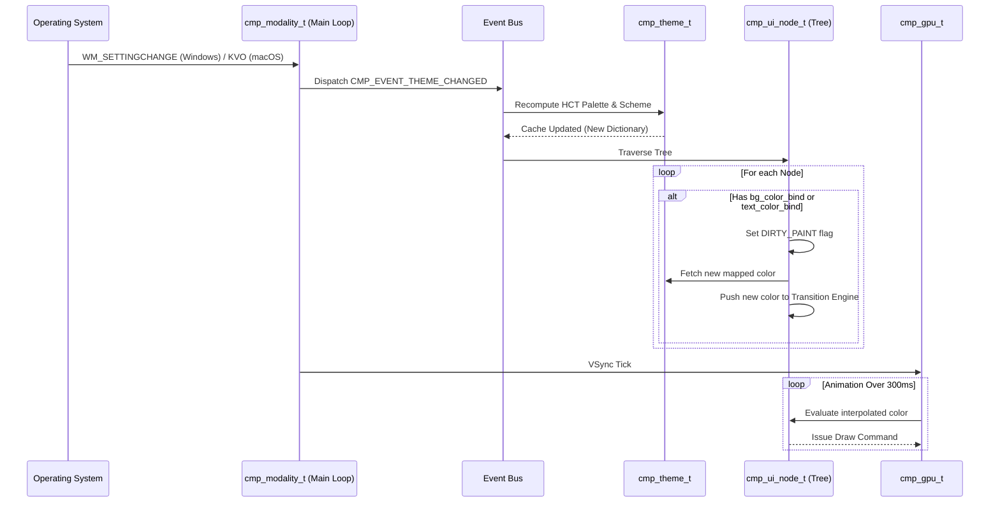

# Theme Data Flow Diagram

The following Mermaid sequence diagram illustrates the lifecycle of a system theme change down to individual node repainting.

## Description
1. The OS signals a system preference change.
2. The core detects this without blocking and pushes a generic `CMP_EVENT_THEME_CHANGED` event to the lock-free ring buffer.
3. The event bus orchestrates the invalidation of the current active color dictionary and rebuilds the HCT tonal schemes.
4. The framework traverses the existing DOM/UI tree. Any nodes using declarative variable bindings are flagged as dirty and queue a cross-fade transition.
5. The compositor updates the GPU vertex buffers incrementally over the next 300ms, creating a smooth transition to dark mode.
